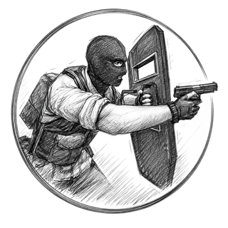
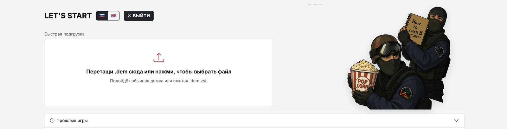
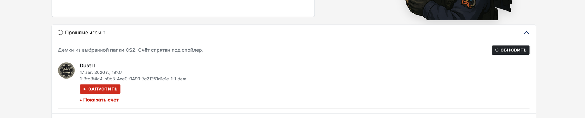

<div align="center">

**[🇬🇧 ENGLISH README HERE](README.md)**



# САМЫЙ ЛЕГКИЙ СПОСОБ<br>ГРУЗИТЬ ДЕМКИ FACEIT<br>с VOICE CHAT!

**Кинул `.dem` → скопировал бинд → вставил в консоль CS2.**<br>
Слышишь только CT, только T или всех — на трёх клавишах.

<br>

<a href="https://github.com/RykivSale/faceit-voicechat/releases/latest/download/faceit-voicechat.exe">
  
</a>
&nbsp;
<a href="https://github.com/RykivSale/faceit-voicechat/releases/latest">
  
</a>

<br>

[](https://github.com/RykivSale/faceit-voicechat/stargazers)
[](https://github.com/RykivSale/faceit-voicechat/releases)
[](LICENSE)
[](https://dalink.to/rykisosali)
[](#кинь-на-кофе)

<br>

**[⬇️  СКАЧАТЬ faceit-voicechat.exe](https://github.com/RykivSale/faceit-voicechat/releases/latest/download/faceit-voicechat.exe)**
&nbsp;·&nbsp;
[все релизы](https://github.com/RykivSale/faceit-voicechat/releases/latest)

<br>



<p><sub>Перетащил демку — получил бинд. Без консольной магии и ручного копирования файлов.</sub></p>

</div>

## Зачем это

На FACEIT скачал демку, открыл в CS2 — а войса нет / слышно всех сразу / непонятно, кого слушать.

Эта прога делает из `.dem` **одну строку** для консоли:

- **F5** — только CT
- **F6** — только T
- **F7** — все голоса

Клавиши можно поменять. Демка сама улетает в папку CS2. `playdemo` тоже копируется одной кнопкой.



Прошлые катки из папки CS2 — иконка карты, дата, красная **ЗАПУСТИТЬ**. Счёт спрятан под спойлер, чтобы не спойлерить.

<div align="center">

<a href="https://github.com/RykivSale/faceit-voicechat/releases/latest/download/faceit-voicechat.exe">
  
</a>

</div>

## Как юзать (30 секунд)

1. **[Скачай `.exe`](https://github.com/RykivSale/faceit-voicechat/releases/latest/download/faceit-voicechat.exe)** → двойной клик.
2. Окно консоли **не закрывай** — это сервер. В браузере откроется `http://127.0.0.1:8765`.
3. Первый запуск: **Найти CS2** (или укажи папку `...\game\csgo` сам).
4. Кинь `.dem` / `.dem.zst` на страницу *или* ПКМ по демке → Open with → этот exe.
5. В CS2 жми `~` → вставь **бинд** → вставь **playdemo**.

Всё. F5 / F6 / F7 переключают, чьи войса слышно на записи.

Можно не кидать файл каждый раз: вкладка **Прошлые игры** → **Запустить**.

## Что умеет

|  |  |
|---|---|
| 🖱️ Драг-н-дроп | `.dem` и сжатые `.dem.zst` |
| 📋 Один бинд | Не три блока, а **одна строка** — копипаст и готово |
| 📁 Автокопия | Демка сама кладётся в `game\csgo` (если уже там — не копирует повторно) |
| ▶️ playdemo | Команда с правильным именем файла, кнопка Copy |
| 🎮 Прошлые игры | Демки из папки CS2 + иконка карты + запуск |
| 🔍 Найти CS2 | Сам ищет Steam-библиотеки |
| ⌨️ Ребинд | F5 / F6 / F7 или любые клавиши, которые ест CS2 |
| 🇷🇺 / 🇬🇧 | Русский и английский |
| 🔄 Апдейты | На старте чекает GitHub Releases |

Настройки живут в `%AppData%\faceit-voicechat\config.json` и не слетают.

<div align="center">

### не нашёл кнопку? вот она ещё раз

<a href="https://github.com/RykivSale/faceit-voicechat/releases/latest/download/faceit-voicechat.exe">
  
</a>

**[⬇️  faceit-voicechat.exe](https://github.com/RykivSale/faceit-voicechat/releases/latest/download/faceit-voicechat.exe)**

</div>

## This fork vs original

Fork of [boris-on/faceit-voicechat](https://github.com/boris-on/faceit-voicechat): same `tv_listen_voice_indices` idea, actually usable UI.

| | Original | This fork |
|---|---|---|
| Bind | 3 separate blocks | **1 line** |
| Keys | Fixed | **F5 / F6 / F7**, rebindable |
| Settings | None | Saved in `%AppData%` |
| Demo file | You move it | **Auto-copied** into `game\csgo` |
| `playdemo` | No | Printed + copy button |
| UI | Prints and exits | **Local page** (drag-drop, past games) |
| Updates | None | Checks GitHub Releases |

**⭐ If this saves you a tilt-queue — star the repo.** Или ☕ [кофе](https://dalink.to/rykisosali) / 💰 [крипта](#кинь-на-кофе).

<a id="кинь-на-кофе"></a>

## ☕💰 Кинь на кофе

Прога бесплатная. Звезда — уже кайф. Если совсем зашла — можно кинуть на кофе.

<div align="center">

<a href="https://dalink.to/rykisosali">
  
</a>
&nbsp;
<a href="https://etherscan.io/address/0x6DE7D78Bdd175B3b35343a2B9473444D3f6AeA16">
  
</a>

<br>

☕ **[dalink.to/rykisosali](https://dalink.to/rykisosali)**
&nbsp;·&nbsp;
💰 **[0x6DE7…eA16](https://etherscan.io/address/0x6DE7D78Bdd175B3b35343a2B9473444D3f6AeA16)**

</div>

Или криптой напрямую. **EVM** (ETH, USDT ERC-20, тот же адрес на Polygon / BSC / Arbitrum):

```
0x6DE7D78Bdd175B3b35343a2B9473444D3f6AeA16
```

Не слать TRC-20 / не-EVM сети — другой формат адреса, донат не дойдёт.

## `--cli` (old-school)

```
faceit-voicechat.exe --cli
```

```
Enter  — print bind
S      — settings
U      — check updates
Q      — quit
```

Bind looks like this:

```
bind "F5" "tv_listen_voice_indices <ct>; tv_listen_voice_indices_h <ct>"; bind "F6" "tv_listen_voice_indices <t>; tv_listen_voice_indices_h <t>"; bind "F7" "tv_listen_voice_indices -1; tv_listen_voice_indices_h -1"
```

If a game folder is set, the demo is copied there and `playdemo <file>` is printed too.

## Build from source

Windows exe (what we ship):

```bash
GOOS=windows GOARCH=amd64 CGO_ENABLED=0 go build -ldflags "-X main.appVersion=1.2.1"
```

macOS / Linux: `go build .` then run the binary. Same local page.

## License

GNU General Public License v3.0 — see [LICENSE](LICENSE).

Copyright (C) 2026 boris-on

## Attribution

If you use this in videos, streams, tutorials, or posts, credit the original author:

https://github.com/boris-on

<div align="center">

<br>

<a href="https://github.com/RykivSale/faceit-voicechat/releases/latest/download/faceit-voicechat.exe">
  
</a>

<br><br>

**скилл не качается. войсы на демке — да.**

</div>
